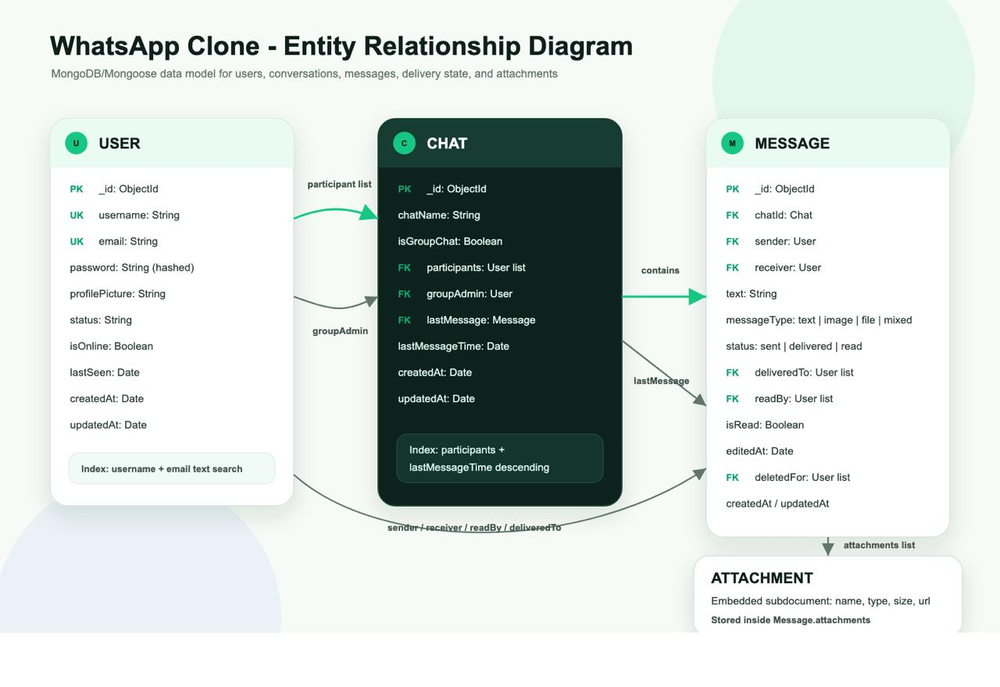
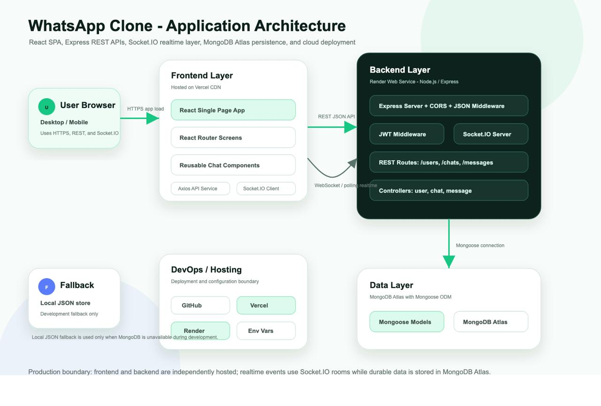

# 🚀 WhatsApp Web Clone

## 🔗 Live Demo  
👉 https://whatsapp-clone-five-murex.vercel.app

---

## 📌 Overview  
A full-stack real-time chat application inspired by WhatsApp Web, built using **Node.js, Express, React, MongoDB, and Socket.IO**.

This project demonstrates:
- Real-time communication  
- Clean API design  
- Scalable architecture  
- Full-stack integration  

---

## ✨ Key Features  

- User authentication (JWT-based)  
- One-to-one chat system  
- Real-time messaging using Socket.IO  
- Persistent chat history (MongoDB)  
- Online/offline presence tracking  
- Responsive WhatsApp-style UI  
- Auto-scroll to latest messages  
- Clear distinction between sent & received messages  

---

## 🧱 Tech Stack  

### Frontend
- React.js  
- React Router  
- Axios  
- CSS / UI framework  

### Backend
- Node.js  
- Express.js  
- Socket.IO  
- MongoDB (Mongoose)  

---

## 📂 Project Structure  

```bash
backend/
  ├── models/
  ├── routes/
  ├── controllers/
  ├── socket/
  └── server.js

frontend/
  ├── src/
  │   ├── components/
  │   ├── pages/
  │   └── services/
  └── public/
```

---

## 📊 Diagrams  

### 🧩 ER Diagram  


---

### 🏗️ Architecture Diagram  


---

## Run Locally

### Clone the Repository
```bash
git clone https://github.com/nandankumar51/WhatsApp-Web-Clone.git
cd WhatsApp-Web-Clone
```

### Backend
```bash
cd backend
npm install
npm run dev
```


### Frontend
```bash
cd frontend
npm install
npm start
```
